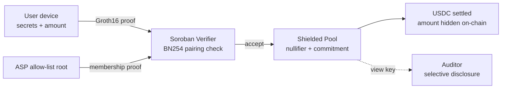

<div align="center">

# 🛡️ ShieldPay

### Compliant private payments on Stellar, powered by zero-knowledge proofs

*Privacy by default · selective disclosure for auditors · ASP allow-list for compliance*

Built **100% solo** for **Stellar Hacks: Real-World ZK** (2026)

</div>

---

## The one-liner

**ShieldPay lets you send USDC on Stellar without revealing the amount or the counterparty — while still satisfying compliance, because an authorized auditor can selectively disclose details and sanctioned addresses are blocked by an on-chain allow-list.**

This is ZK doing *real work*: remove the proof and the pool literally cannot settle a transfer.

## Why this matters (the real-world problem)

Public ledgers expose every payment amount and counterparty. That's a non-starter for salaries, B2B settlement, and institutional flows. The naive fix — full anonymity — breaks KYC/AML and regulators reject it. So real money stays off-chain.

ShieldPay threads the needle:

| | Transparent chains | Fully anonymous mixers | **ShieldPay** |
|---|---|---|---|
| Amounts hidden | ❌ | ✅ | ✅ |
| Counterparties hidden | ❌ | ✅ | ✅ |
| Auditor disclosure | n/a | ❌ | ✅ (view key) |
| Sanctioned-address blocking | ❌ | ❌ | ✅ (ASP root) |
| Real stablecoin rails | ✅ | ⚠️ | ✅ (USDC) |

## How the ZK is load-bearing

1. **Prove (browser):** A Circom circuit (`circuits/transfer.circom`) proves a valid shielded transfer — value conservation, note ownership, Merkle membership, and recipient ASP membership — without revealing private inputs. Proof generated client-side via WASM.
2. **Verify (Stellar):** A Soroban Groth16 verifier (`contracts/verifier`) checks the proof on-chain using BN254 + Poseidon host functions (Protocol 25 “X-Ray” / 26 “Yardstick”).
3. **Settle (pool):** The shielded pool (`contracts/pool`) only burns the nullifier and inserts the output commitment **if** the verifier accepts. No proof → no transfer.
4. **Disclose (compliance):** A view key lets an auditor reconstruct the amount + counterparty for a specific transfer when legally required.



## Architecture

```
shieldpay/
├─ circuits/transfer.circom        # ZK circuit (Poseidon + Merkle, 20-level tree)
├─ contracts/
│  ├─ verifier/                    # Groth16 verifier (Soroban, BN254 host fns)
│  ├─ pool/                        # shielded USDC pool (deposit / transfer)
│  └─ asp/                         # ASP allow-list root contract (compliance)
├─ web/                            # white + colorful landing & live demo
├─ scripts/setup.sh                # circuit compile + trusted setup (snarkjs)
├─ scripts/deploy.sh               # build + deploy contracts to testnet
└─ docs/ARCHITECTURE.md            # deep dive + threat model
```

## Tech stack

- **ZK:** Circom 2 + Groth16 (snarkjs) — chosen for the cheapest on-chain verification.
- **Hashing:** Poseidon (matches Stellar's native host function for cheap on-chain recompute).
- **Chain:** Stellar / Soroban (Rust), BN254 pairing via Protocol 25/26 host functions.
- **Asset:** USDC (Stellar Asset Contract).
- **Frontend:** single-file site, Web Audio API, zero build step.

## Quickstart

> Requires Rust + the `wasm32-unknown-unknown` target, the Stellar CLI, Node 18+, and Circom 2.

```bash
# 1. Compile circuit + run a (demo) trusted setup
bash scripts/setup.sh

# 2. Build & deploy the three contracts to Stellar testnet
bash scripts/deploy.sh

# 3. Serve the frontend
cd web && python3 -m http.server 8080
# open http://localhost:8080
```

After `deploy.sh`, paste the printed contract IDs into `web/js/app.js` → `CONFIG`.

## Live demo + verification

- **Demo video:** _<link — 2–3 min walkthrough>_
- **Deployed verifier (testnet):** _<contract id>_
- **Example verified tx hash:** _<stellar.expert link>_

> The on-screen demo simulates the flow for instant feedback; the `Send` path is wired (`web/js/app.js`) to generate a real Groth16 proof and submit it to the deployed verifier on testnet.

## Roadmap (2026 → 2027)

- **Q3 2026** — Win & harden: open-source circuits + verifier, full test suite, run OpenZeppelin Soroban security detectors.
- **Q4 2026** — Mainnet alpha (capped) + Stellar Wallets Kit + start formal audit.
- **Q1 2027** — Compliance SDK: drop-in view-key disclosure + ASP integration for issuers/payroll/exchanges.
- **Q2 2027** — Confidential Token standard alignment: hidden balances, public addresses.
- **Q3 2027** — Private remittance corridor: fiat on-ramp → shielded transfer → fiat off-ramp with compliance proofs.

## About the author

Designed and built **entirely solo by a 17-year-old developer** — circuits, contracts, disclosure layer, and frontend. From idea to a working Stellar-testnet demo.

## Credits & prior art

- Nethermind `stellar-private-payments` (Circom + Groth16 + ASP research PoC) — inspiration for the privacy-pool design. *Unaudited research code; testnet only.*
- `stellar/soroban-examples` Groth16 verifier.
- Stellar developer docs: ZK & privacy guides, Protocol 25/26 release notes.

## Security & status

⚠️ **Testnet / hackathon prototype.** The trusted setup in `setup.sh` is a demo ceremony, the BN254 host-function bindings target Protocol 25/26, and nothing here is audited. Do **not** use with real funds.

## License

MIT — see [LICENSE](./LICENSE).
